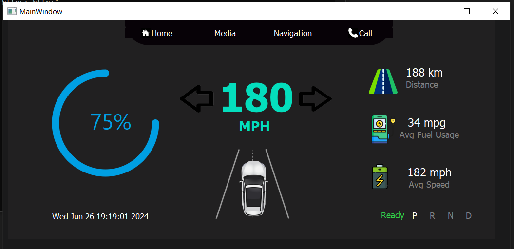
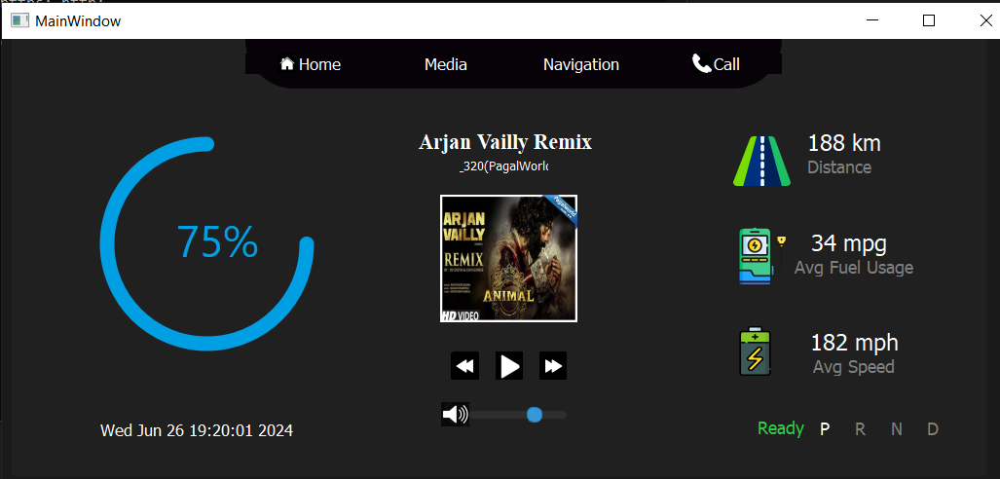
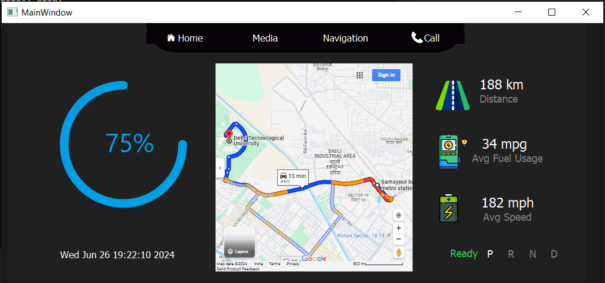
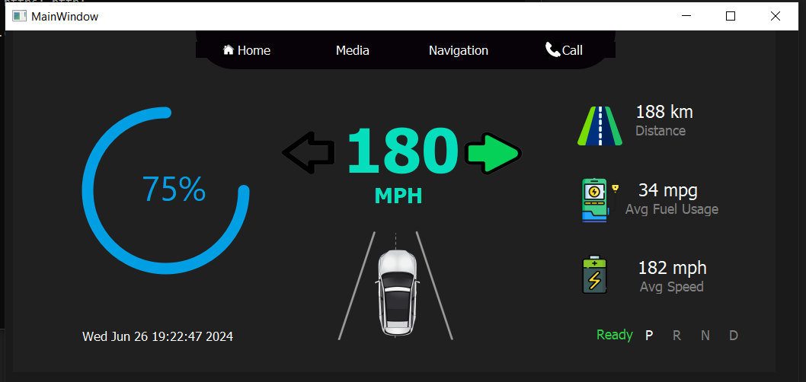
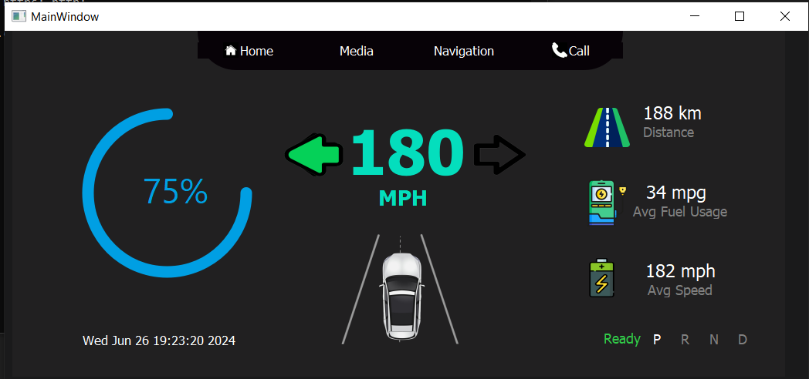

# Electrical Car Dashboard

[](https://www.python.org/)
[](https://pypi.org/project/PyQt5/)
[](https://www.pygame.org/news)

## Overview

The **Electrical Car Dashboard** is a Python-based graphical user interface (GUI) designed to simulate the dashboard of an electric vehicle. This project, developed while a member of the EVRT Center of Excellence (COE) at DTU, incorporates several key features typical of modern car dashboards including speed, distance, gear, battery percentage, and more.

*Dashboard*:-



## Features

- **Speed Display**: Real-time visualization of vehicle speed.
- **Distance Tracker**: Shows the total distance covered.
- **Gear Indicator**: Displays the current gear of the vehicle.
- **Start/Stop Button**: Control for simulating engine start and stop.
- **Battery Percentage**: Indicates the remaining battery level.
- **Music Player**: Integration with Pygame for audio playback.
- **Navigation**: Basic navigation display.
- **Date and Time**: Shows current date and time on the dashboard.

## Demo

Below are some screenshots showcasing the various windows and functionalities of the dashboard:

*Music Player Interface*:-



*Navigation Display*:-



*Left Indicator*:-



*Right Indicator*:-




## Installation

To run the Electrical Car Dashboard, follow these steps:

1. **Clone the Repository**
   ```
   git clone https://github.com/prathamu200/ElectricalCarDashboard.git
   cd ElectricalCarDashboard
   ```
2. **Creating Virtual Environment (Optional)**
   ```
   python -m venv venv
   source venv/bin/activate   # On Windows use `venv\Scripts\activate`
   ```
3. **Install Dependencies**
   ```
   pip install pyqt5 pygame
   ```
4. **Run Application**
   ```
   python3 ElectricCarDashboard.py
   ```
# Contributing
Contributions are welcome! Please fork the repository and submit a pull request with your improvements. Make sure to follow the project's coding standards and provide detailed descriptions of your changes.

# Contact
For any queries or issues, please contact prathamu200@gmail.com.
   


